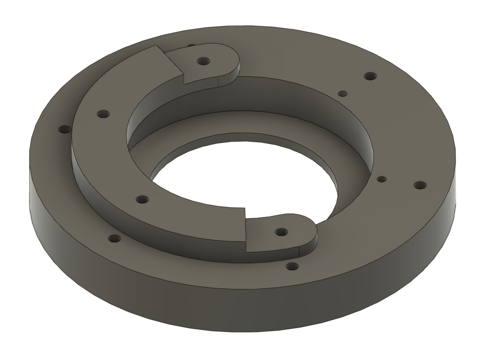

## Edwards EXT70 Turbopump adapter flange

```mounting_flange.f3d``` Fusion360 file exported to ```mounting_flange.step``` for compatibility.

To fit the Cambridge StereoScan 260's bottom port.

The image below shows the two unique parts needed for the mounting flange. The smaller collar piece should be fabricated twice to form a two-part locking collar around the neck of the turbo-pump. The larger flange mates against the underside of the chamber body.



### Large flange details

Outer 6 holes at 4.5mm diameter, 134mm center-to-center, equally spaced, allow for M4 mounting to bottom of StereoScan.

Inner 3.3mm blind holes should be M4 tapped for mounting two-piece collar.

The reverse of the flange (which sits against the chamber) has a gasket groove (4mm wide, 2mm deep) for a compression seal.


### Two-part collar

The collar piece, when duplicated, interlock to form a complete ring around the shoulder of the turbo pump. The large turbopump inlet from the chamber sits on the recessed large flange lip with the stock captured o-ring that comes with the pump. This is comressed via the collar when secured down to the large flange via the 6 M4 fasteners.


## Release Valve

The EXT70 has a release valve port which is has an M5 thread and 18mm diameter flat gasket surface for a gasketted screw stop to tighten against. Mine was missing, so I fabricated a simple 18mm head M5 screw with internal gasket recesses.