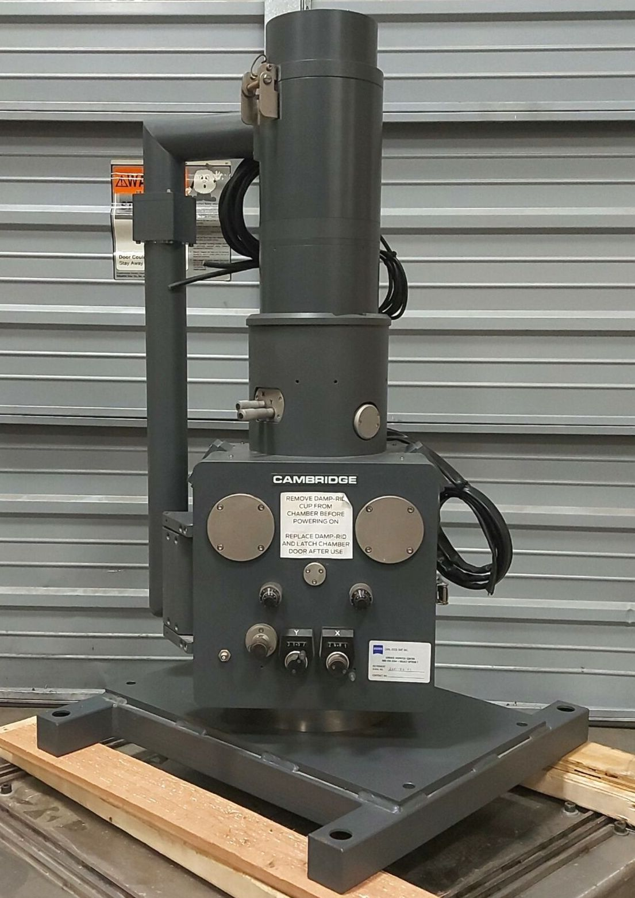
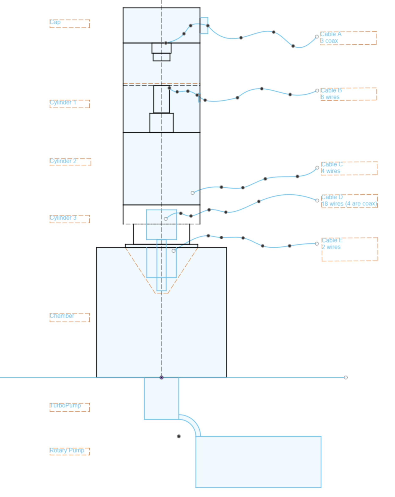
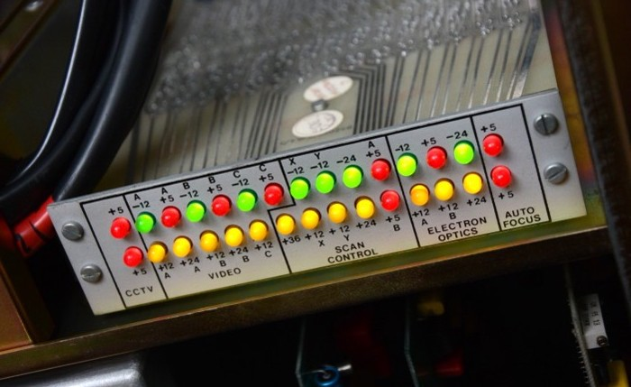

# Cambridge StereoScan 260 Wiring

This document serves as a wiring reference for the Cambridge StereoScan 260 Scanning Electron Microscope (SEM). My own StereoScan was purchased with cut wires and no control electronics. My intention is to drive the microscope with an open HW/SW control board and power electronics.

## Electron Beam Path Schematic

Below is a coarse schematic of the main components of the electron beam path (from emission to impact with sample). The schematic introduces naming for the main column blocks (without assuming particular function) and labels for the associated cable connections which we will document below.

## Block Functions

Based on observations and cabling below, we wish to understand these different blocks and how they should be interfaced / driven. Current Understanding of blocks show below:

Cap: Thermionic Emission Filament + Accelerating voltage (EHT)

Cylinder 1: Condensor?

Cylinder 2: Deflection Coils?

Cylinder 3: Stigmata + ?

Cone: Objective (focus)

## Cables

Identification and measurement of cables:

### Cable A (from cap)

3 seperate black coax from cap. We'll name them [A.E, A.F, A.G] (naming has been organic, sorry)

Coax jacket diameter: 8.0mm, Conductor diameter: 0.9mm

**A.E**: Filament terminal 1

**A.G**: Filament terminal 2

**A.F**: Anode

**A.E ---[0.3Ω]--- A.G** (measured filament  terminals, not through cable)

### Cable B (from Cylinder 1)

8 colored wires in black jacket. Connected in pairs through resistive load (presumably coils). Wires terminated at device with one brown connector. Measured resistances are from the device terminals (not through the cables).

**Brown ---[10Ω]---white**

**red ---[10Ω]---green**

**black ---[15Ω]---purple**

**yellow ---[15Ω]---blue**

### Cable C (from Cylinder 2)

4 colored wires in thick black jacket, male and female spayed pairs. 3 wires have numbered rings indicated in brackets below. Resistances measured through cables.

**Orange ---[3.8Ω]---yellow(5)**

**Green(2) ---[3.8Ω]---blue(3)**

### Cable D (from coil device in Cylinder 3, protrudes into cone)

18 wires total in black jacket, 14 colored, 4 black coax. Terminated at device with 6 brown connectors around central black cylinder (presumably coils). The six connectors are labeled PL1, PL2, PL3, PL4, PL5 and PL6 at the device. Looking at the device from below, we'll label the connections with letters clockwise per connector, e.g. 1A, 1B, 1C, 1D, 2A, 2B. Not all pins on connectors at device are populated with cable (marked x below)

* PL1
  * A: x
  * B: purple
  * C: orange
  * D: brown
* PL2
  * A: coax
  * B: grey
  * C: coax
* PL3
  * A: red
  * B: orange
  * C: blue
  * D: coax
  * E: red
* PL4
  * A: yellow
  * B: brown
  * C: coax
* PL5
  * A: x
  * B: black
  * C: x
  * D: white
  * E: yellow
* PL6
  * A: x
  * B: green
  * C: x

The device terminal connections appear to be 6 resistive networks (2 with 3 intermediate taps, 1 with 1 tap, and 3 without taps). Resistive measurements are approximate in the network diagrams below:

**5B** ---[12.5Ω]--- **5D** ---[12.5Ω]--- **1B** ---[12.5Ω]--- **2B** ---[12.5Ω]--- **3C** (stigmata A?)

**5E** ---[12.5Ω]--- **6B** ---[12.5Ω]--- **1C** ---[12.5Ω]--- **3E** ---[12.5Ω]--- **4B** (stigmata B?)

**1D** ---[2Ω]--- **5C** ---[1Ω]--- **3A**

**3B** ---[3Ω]--- **4A**

**2A** ---[1.7Ω]--- **2C** (both coax)

**3D** ---[1.9Ω]--- **4C** (both coax)

### Cable E (to coil inside cone, around device from Cable D)

2 black cables with a numbered sleeve

2: male spayed connector

4: female spayed connector

**2** ---[5.6Ω]--- **4**

## Controls

[Source StereoScan 260 Youtube](https://www.youtube.com/watch?v=E9pEZvchzuI)

In lieu of an operating or repair manual, here is a screenshot of the original control panel from a StereoScan 260 MkIII as a hint at what the cables above would connect to. 

## Power

[Source StereoScan 260 Youtube](https://www.youtube.com/watch?v=E9pEZvchzuI)

Similarly, here is the power status panel from the original StereoScan MkIII controller.

